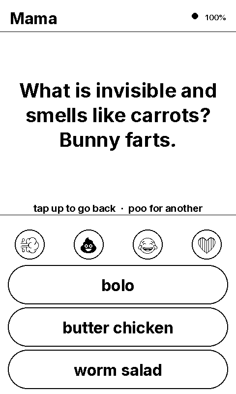
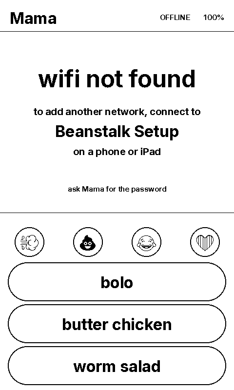

# Beanstalk

Beanstalk is a very small messaging system.

Send messages from Telegram to the e-ink panel, respond with pre-configured reply buttons or set new replies at any time.

Preloaded with a bank of jokes with the ability to add more.

<p align="center">
  
  
  
</p>

## What you need

| | |
|---|---|
| Seeed reTerminal Sticky | The panel. ESP32-S3, 3.97" e-ink, touch, battery |
| Raspberry Pi, or any always-on Linux machine | Runs the bridge, at the sender's end |
| A free MQTT broker account | HiveMQ Cloud's free tier |
| Telegram | The sender's side of the conversation |

## How it works

An MQTT broker is a hosted relay. Both ends log in to it and it passes
messages between them.

The panel and the bridge both dial out to the broker. Neither listens for
connections, so the panel can sit on a network you do not control — another
home, a classroom, a grandparent's kitchen — with no port forwarding and no
VPN. The bridge turns Telegram into MQTT and back.

```
sender's phone            your network                anywhere with wifi

Telegram  <-->  bridge (Pi)  <-->  broker  <-->  panel
```

## What it does

- The bridge pairs with a single Telegram chat at setup. No other
  chat can reach the panel.
- 3 reply buttons by default in the firmware. The sender can set new defaults
  from Telegram to go with any single message.
- A fart button with sound, plus laugh, heart, and a tell-a-joke button.
- 20 jokes built into the panel, so the joke button works without a network. More can be added from Telegram or updated in batch.

## Setting it up

Clone the repo. Every command below runs from its root.

    git clone https://github.com/ronnieftw/beanstalk.git
    cd beanstalk

Four steps. `bridge/README.md` has the full walkthrough and every chat command.

1. Make a Telegram bot with `@BotFather`, and two credentials on your broker,
   one for each end, both with publish and subscribe. Note the broker's
   hostname and port; `setup.html` asks for them.
2. Open `setup.html` in a browser. It writes `secrets.yaml` and
   `beanstalk.env` — the only two files that hold your settings.
3. Flash the panel. See Flashing the panel below.
4. Install the bridge. `setup.html` prints these with your Pi filled in:

       scp ~/Downloads/beanstalk.env bridge/beanstalk.py bridge/beanstalk.service \
           bridge/install-beanstalk <pi>:~/
       ssh <pi> './install-beanstalk'

   It ends by printing a pairing code. Send that code to your bot, and that
   chat is the sender from then on.

## Flashing the panel

Install ESPHome Device Builder from esphome.io/install. It is a desktop app for macOS, Windows and Linux. On first launch it will open in a browser window at `localhost:6052` (needs to be running in Chrome or another Chromium browser for USB flashing to work; open that address there if your default browser is something else). Device Builder will ask for a folder to keep configs in. Choose the repo.

Put `secrets.yaml` in the repo root, then:

    cp sticky.yaml.example sticky.yaml

Once `sticky.yaml` exists, a
card named reTerminal_Sticky appears in Device Builder.

Open the card's menu and choose Validate. Fix anything it reports before
flashing. Click Install.

The first flash is over USB, select Plug into this Computer:

1. First take out any microSD card in the Sticky. The card and the display share a bus, and a card
   in the slot stops the flash.
2. Plug the panel into the computer with a USB-C cable that carries data. No
   buttons need to be held.
3. Pick the serial port it offers. On macOS it is named like `cu.usbmodem…`.
   If no port appears, the cable is charge-only. On Linux, add your user to
   the `dialout` group and log back in.
4. The first build will take several minutes. The panel restarts on its own when
   the flash finishes.

When the panel comes back up, the header shows the sender name and the thread
says `no messages yet`. A dot in the header means it has reached the broker.
`OFFLINE` means it has not: either wifi or the broker hostname and panel
credential in `secrets.yaml`. Logs, on the card's menu, shows the serial output
while the panel is plugged in, including wifi and broker errors.

Every flash after that is over wifi: Install, then Wirelessly. The panel needs
to be on the same network as the computer.

## The screen


| Area | Contents |
|---|---|
| Header | Sender name, `(muted)` when sound is off, battery percentage, `OFFLINE` when the broker link is down |
| Thread | The last three messages as bubbles, each with a timestamp |
| Reaction row | Four round buttons: 💨 💩 😂 ❤ |
| Reply row | Three pills carrying the labels the sender set |


## Receiving a message

A new message takes the whole panel, inverted, with `TOUCH TO REPLY` below
it. Touching it returns to the thread view, where the message becomes the newest bubble.
The sender receives `(message read)`.

The panel only keeps the last three messages. Older ones are lost to the sands of
time.

## Sending/Replying

The user can send or reply to messages by clicking any of the reply buttons or the pre-loaded emoji buttons. Reply buttons start with 3 defaults but new sets can be loaded or customized in any message from the sender.


| Button | Panel | Sender receives |
|---|---|---|
| 💨 | a fart noise | `PFFFFT! 💨` |
| 💩 | a joke on screen | `(read a joke)` |
| 😂 | a chirp | `HAHAHAHA! 😂` |
| ❤ | a chirp | `I love you ❤` |


## Jokes
Twenty jokes are compiled into the firmware, so this button works with no
network at all. More can be sent to the bot as a `.txt` file, which replaces
the set without a reflash. A joke takes over the thread area until it is tapped or replaced.

## Physical buttons

| Button | Action |
|---|---|
| UP | Force a redraw. Confirms the device is alive |
| DOWN | Toggle sound. A beep confirms on, the header shows `(muted)` for off |
| OK, tap | Send the first reply label. Physical fallback for the touch zones |
| OK, hold | Three warning beeps at four seconds, then restart if released between five and twenty |

## When the network is down

The header says `OFFLINE`. Replies queue and print `waiting to send`.

After fifteen minutes with no wifi, setup instructions replace the thread.
Join the wifi network named `Beanstalk Setup` from a phone or iPad. The
password is the AP password from `setup.html`. A setup page opens on its own.
It takes new wifi credentials, and it can also take a firmware `.bin` upload,
the one recovery path that needs no laptop and no cable.

The reaction row and reply pills stay drawn throughout. Sounds, jokes and
queued replies keep working.

<p align="center">
  
</p>

E-ink holds its last frame with the power off. A dead pipeline therefore looks
exactly like a quiet day, which is why the sync timestamp, the `OFFLINE`
marker and the `(muted)` flag are all on screen rather than inferred.

## Privacy and security

The bridge pairs with a single Telegram chat and answers nothing
else. Anyone else who finds the bot is ignored, and their chat id is logged on
the Pi.

Messages are NOT end-to-end encrypted. Who sees what:

| | Sees |
|---|---|
| Telegram | Every message, both directions. Bot chats are not end-to-end encrypted |
| The broker | Every message, reply and read receipt, decrypted. TLS runs to the broker, not through it. It keeps the current reply buttons, jokes and battery level; it does not keep messages |
| The Pi | That messages moved, not what they said. However, if the `LOG_LEVEL` is set to `DEBUG` in `beanstalk.env`, message content will be logged in the journal |
| The panel | The last three messages, the reply buttons and the mute state, in flash. The same things that are on the screen |
| The sender | When a message is touched on the panel |

`secrets.yaml` and `beanstalk.env` hold every credential. Both are gitignored.
On the Pi, `beanstalk.env` is mode 600, owned by root.

Anyone who joins the panel's setup network can change its wifi. The password
is not shown on screen. It does print in the serial log.

`/reboot` works through a broker topic. Anything with the broker credentials
can press it. This allows for remote resets by the sender for debugging purposes.

## Layout

| Path | What |
|---|---|
| `setup.html` | Open it in a browser to write the `secrets.yaml` and `beanstalk.env` configs. Runs offline on your local machine.|
| `sticky.yaml.example` | The panel. ESPHome config, display lambda, every touch zone. Copy to `sticky.yaml`, which is gitignored |
| `secrets.yaml.example` | Keys `sticky.yaml` expects. `setup.html` writes the real one |
| `bridge/beanstalk.py` | Telegram ↔ MQTT bridge |
| `bridge/README.md` | Bridge setup and every chat command |
| `bridge/install-beanstalk` | Install or update beanstalk. |
| `docs/` | Screenshots |

## License

MIT. See `LICENSE`.
